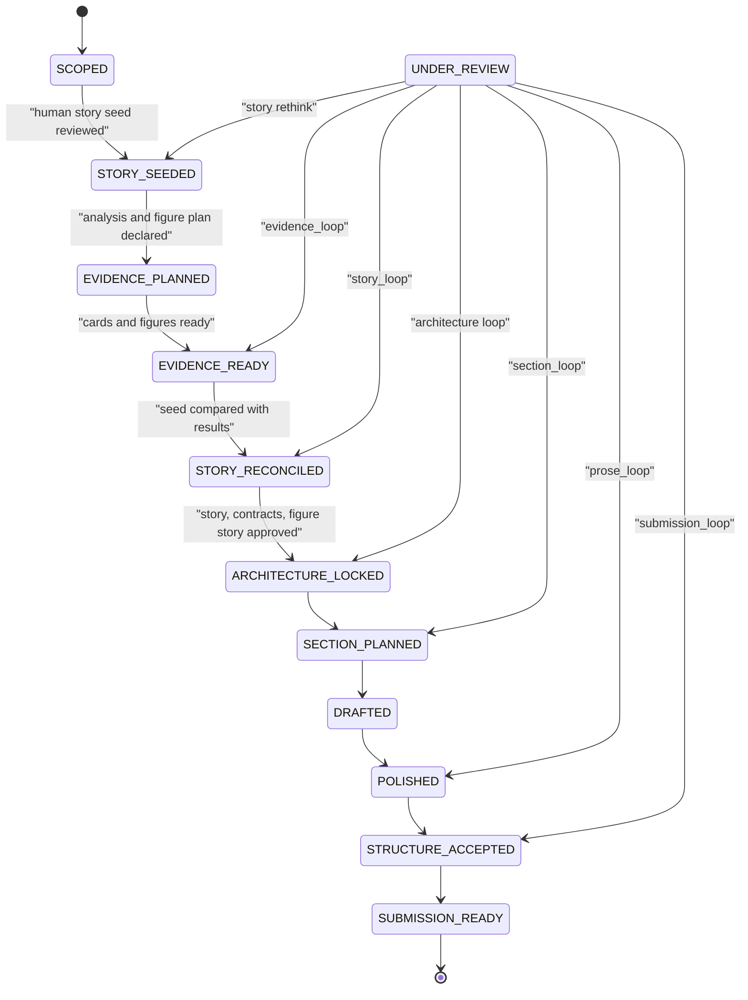
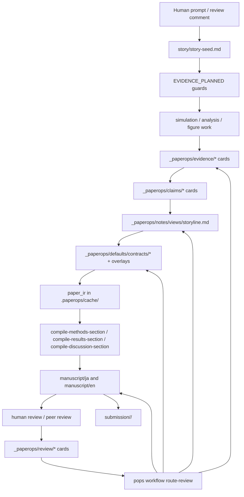

# paperops 現行仕様書

この文書は、現時点の `paperops` テンプレートと `pops` CLI の仕様を棚卸しするための仕様書である。ルート層のテンプレート管理と、`template/` から作られる下流論文プロジェクトの仕様を分けて記述する。

## 1. 基本思想

`paperops` は、AI に原稿を直接書かせるための単純な scaffold ではない。研究結果、主張、証拠、レビュー、追加解析依頼、投稿前確認を、本文とは別の検証可能な中間層へ整理し、承認済みの材料だけを原稿へ変換するためのハーネスである。

今回の設計では、人間が普段感知する面と、AI が執筆に使う内部状態を明確に分ける。

- 人間の主な接点: prompt、`story/`、`manuscript/`、`submission/`、レビューコメント
- AI/ハーネスの内部状態: `_paperops/`
- 未整理入力: `_handoff/`
- 過去稿封印: `_archives/`
- 生成一時物: `.paperops/cache/`

人間は、毎回 `_paperops/evidence/` や `_paperops/claims/` の細部を巡回しなくてもよい。AI はそれらを読み、必要に応じて card、contract、workflow state、review record を更新し、最後に本文へ反映する。

## 2. 二層構成

### 2.1 ルート層

ルート層はテンプレート管理リポジトリである。

- `src/paperops/`: `pops` CLI
- `template/`: 下流論文プロジェクトへ展開される scaffold
- `docs/`: アーキテクチャ、配布、CLI、変更方針、仕様書
- `.agents/skills/`: テンプレート保守 skill
- `.github/`: issue template、workflow、release/publish workflow
- `scripts/`: release、package boundary、smoke helper

ルート層の責務は、下流 scaffold の進化、互換性、配布、テストである。

### 2.2 下流論文層

`template/` は `pops init` によって個別論文 repo へ展開される。

```text
story/                         人間向けの構想、story seed、上位ストーリーライン
AGENTS.project.md              Codex 向け project-owned 恒久指示
CLAUDE.project.md              Claude Code 向け project-owned 恒久指示
Makefile.project               project-owned tracked Make target
manuscript/                    日英原稿、共有アセット、ミラー制御、投稿先情報
submission/                    投稿先公式テンプレートと最終提出用 TeX
_paperops/                     AI/ハーネス内部 state
_paperops/defaults/            paperops-managed の標準 contract と workflow kernel
_paperops/contracts/           project 固有の contract overlay
_paperops/workflow/            現在状態、review loop、stale 伝播、人間判断、任意の workflow overlay
_paperops/refs/                文献、外部 source、外部 link、import state、local path alias
_paperops/evidence/            result / figure / source card
_paperops/claims/              claim / scientific gate / argument card
_paperops/review/              feedback / review round / response card
_paperops/requests/            analysis / writing request card
_paperops/notes/views/         pure overview view と controlled authoring view
_paperops/notes/               AI 利用、再現性、handoff、decision log
_handoff/                      未整理ファイルの一時受け取り箱
_archives/                     sealed scratch archive
.paperops/cache/               生成一時物、section plan、paper_ir
scripts/                       検証、ビルド、ミラー、レビュー回収 helper
```

旧 top-level の `contracts/`、`workflow/`、`refs/`、`evidence/`、`claims/`、`review/`、`requests/`、`notes/` は互換読み取り対象である。ただし新規 scaffold の正道は `_paperops/` である。

## 3. 人間向け story 層

`story/` は、人間が論文を書く前に持つ素朴な構想を置く層である。ここは detailed contract ではなく、研究の意図、期待する結果、結果が外れた場合の分岐を自然文で扱う。

主なファイル:

- `story/README.md`
- `story/story-seed.md`

`story/story-seed.md` の役割:

- 研究質問を書く
- 初期メカニズム仮説を書く
- 期待する evidence path を書く
- 結果が仮説と合わない場合の分岐条件を書く
- 解析・図表・追加 simulation の計画メモを書く
- evidence が出た後の reconciliation メモを書く

例として、プラズマによる月面ダストの静電的離脱可能性の simulation 論文なら、最初に次のような高次構想を置く。

- どのように粒子層表面が帯電するか
- どのメカニズムで離脱可能なクーロン力が得られるか
- 帯電進行に伴う時系列で離脱可能性が見えるか
- 離脱経路での仕事や速度がどの程度か
- 上流条件、粒径、配置に対する依存性はどこまで言えるか
- 結果が想定より弱い場合、negative / boundary story として何を主張するか

## 4. C 案 workflow state

原稿前 story 設計は、単一の `STORY_LOCKED` では粗すぎるため、C 案として workflow state を増やす。



状態の意味:

- `SCOPED`: repo と論文対象はあるが、story seed はまだ固定していない。
- `STORY_SEEDED`: 高次ストーリー、初期仮説、期待する evidence path、分岐条件を人間が確認した。
- `EVIDENCE_PLANNED`: 必要な simulation、analysis、figure、比較軸、成功/修正基準を列挙した。
- `EVIDENCE_READY`: result / figure / source card が揃い、論文材料として検討できる。
- `STORY_RECONCILED`: story seed と実結果を照合し、主張範囲、negative / boundary story、修正後の論旨を確認した。
- `ARCHITECTURE_LOCKED`: storyline、section contract、figure story が本文生成に入れる程度に固定された。
- `SECTION_PLANNED`: section ごとの読者質問、answer、evidence、figure、caveat location が計画された。
- `DRAFTED`: 本文 draft がある。
- `POLISHED`: 文体、語彙、段落、図表参照が整っている。
- `STRUCTURE_ACCEPTED`: 原稿構造と内容 blocker が閉じている。
- `SUBMISSION_READY`: 投稿先固有の front matter、metadata、license、Open Research、human verification が揃っている。

## 5. 全体ワークフロー



レビュー後は一方向に進めない。Issue Router が evidence、story、section、prose、submission のどこへ戻すかを決める。

## 6. `_paperops/` 内部 state

### 6.1 evidence

`_paperops/evidence/` は、結果や図表を論文上の証拠単位へ整理する。

- `results/`: result card
- `figures/`: figure card
- `sources/`: source card

result card は quantity contract、scope、claim link、source artifact を持つ。figure card は supported claims、visual obligation、caption status、本文参照に加え、`design-paper-figure` が作る図の設計意図、reader task、takeaway、encoding、scale/denominator、uncertainty/distribution、caption、runops handoff の Figure design brief を持つ。source card は、summary だけでは足りない claim_boundary、parameter_choice、reviewer_objection、method_precedent の根拠を持つ。

### 6.2 claims

`_paperops/claims/` は、論文で言ってよい主張の正本である。

- `claims/`: claim card
- `gates/`: scientific gate card
- `arguments/`: argument card

claim card は evidence strength、scope、depends_on、visual_obligations を持つ。scientific gate は Abstract / Conclusion / main figure caption に出せるかを確認する。

### 6.3 review

`_paperops/review/` は、人間レビュー、模擬査読、実査読対応を管理する。

- `feedback/`: feedback card
- `rounds/`: review round
- `responses/`: response card

subagent を使う場合、review round に delegation ledger と integration decision を残す。main agent は orchestrator として、subagent report をそのまま本文へ混ぜず、claim/evidence/request/section plan へ統合する。

### 6.4 requests

`_paperops/requests/` は、追加解析、再計算、図表生成、改稿依頼を paper 側文脈と acceptance criteria 付きで外部へ渡す層である。

- `analysis/`: analysis request card
- `writing/`: writing request card

`check-research-request-handoff.py` は、open request と linked runops queue の `runops_id`、status、local path を照合する。

### 6.5 refs

`_paperops/refs/` は、文献、外部 source、外部 project link、import state を扱う。

- `links.toml`: 共有可能な link intent
- `local/locations.toml`: 個人環境の絶対パス。ignored file
- `imports/`: 外部 export bundle の import state
- `summaries/`: 採用文献や source の確認済み要約
- `research/`: 関連研究調査の outline / field / raw result
- `source-reach/`: Web、GitHub、RSS、動画などの source channel 方針

tracked file に個人環境の絶対パスを混ぜない。

### 6.6 notes と views

`_paperops/notes/` は、AI が執筆判断に使う作業メモである。`notes` に多責務を持たせるのではなく、カード、契約、workflow の間を補助する内部メモとして扱う。

`_paperops/notes/views/` には二種類の view がある。

- pure overview view: card 正本を俯瞰する
- controlled authoring view: 本文語彙、条件名、読者順序、story spine を統制する

重要な controlled authoring view:

- `storyline.md`
- `concept-terms.md`
- `condition-context-map.md`
- `argument-map.md`

`concept-terms.md` は概念語ビューであり、claim / argument / evidence card の意味を強い英語名詞句へ圧縮しすぎていないかを確認する。`concept-term-check` は concept-term compression を検出し、必要なら普通の文へほどくよう促す。

## 7. 契約の概念

`_paperops/defaults/contracts/` は文章テンプレートではない。論文全体、section、figure story が、読者のどの疑問に答え、何を入力にし、どの出力を作り、何を禁止するかを定める paperops-managed の標準契約である。論文固有に変える場合だけ `_paperops/contracts/` に同名 overlay を置く。

主な契約:

- `storyline.yml`: story spine、reader promise、central claim、evidence ladder、Results hierarchy、Discussion functions
- `introduction.yml`: problem、unresolved tension、gap、approach、contribution、scope
- `methods.yml`: information placement、main text / supplement / code 配分、verification
- `results.yml`: reader question、answer、evidence、scope、consequence
- `discussion.yml`: mechanism hypothesis、alternative explanation、implication、prediction、limitation
- `conclusion.yml`: take-home message、supported scope、future work
- `figures.yml`: figure story、visual obligations、missing figure policy

契約は Writer の前に読む。Writer に raw card ontology を直接渡しすぎず、section compiler が読者向けの `paper_ir` へ変換する。

## 8. paper_ir と section compiler

`paper_ir` は、card と controlled authoring view から作る生成一時物である。手書き正本ではない。通常は `.paperops/cache/` に置く。

最小フィールド:

- `id`
- `section`
- `reader_question`
- `answer`
- `evidence`
- `warrant`
- `role`
- `preceded_by`
- `followed_by`
- `caveat_location`
- `sentence_budget`
- `forbidden_terms`
- `plain_language_terms`

section compiler:

- `compile-methods-section`: method unit ごとに本文 / supplement / code への配分、非標準性、結果感度、再実装情報を決める。
- `compile-results-section`: reader question -> one-sentence answer -> quantitative evidence -> figure -> baseline / comparator rationale -> consequence の順に結果を並べる。
- `compile-discussion-section`: observation / inference / mechanism_hypothesis / alternative_explanation / implication / prediction / limitation を分ける。
- `draft-predicted-results`: 未実行だが投稿前に現実的な追加シミュレーションを、`PREDICTED-RESULT` / `SIM-REQUEST` comment、`xx` 置換条件、`_paperops/requests/analysis/` つきの予測稿として扱う。
- `review-block-flow`: DRAFTED section の block operation table を作り、author stance、reader question、why here、move / split / merge / delete / add を確認してから AUDITED へ進める。

`check-section-contracts.py` は、`_paperops/notes/views/storyline.md` の controlled authoring view から Results hierarchy、Discussion functions、Methods definition registry を確認する。`audit` では warning として扱い、`finish-manuscript-check` では strict error として扱う。これは section-depth の文字数 floor とは別の semantic coverage gate であり、水増しではなく baseline rationale、decision criteria、mechanism warrant などの不足へ戻すための検査である。

## 9. CLI 仕様

`pops` は、研究判断や本文編集ではなく、決定的なファイル操作と scaffold 管理を担当する。

主な command:

- `pops init [path]`: bundled scaffold から新規論文 repo を作る。
- `pops setup [path]`: 既存 repo を `.pops` 管理に採用する。
- `pops doctor [path]`: 構造、`.pops`、Git / make、workflow placeholder、link registry を確認する。
- `pops update-paperops`: 管理対象ハーネスファイルの更新計画を表示する。
- `pops update-paperops --apply`: 不足している管理対象ファイルだけ追加する。
- `pops update-paperops --apply --force`: 差分がある管理対象ファイルも上書きする。
- `pops update-paperops --apply-chain`: checkpoint release ごとの `pops` を exact version で呼び替える。
- `pops migrate list/show/apply`: 下流 project state の migration item を確認・適用する。
- `pops links list [path]`: `_paperops/refs/links.toml` の外部 link を表示する。
- `pops links check [path]`: link registry と local location の対応を検証する。
- `pops workflow status [path]`: 論文全体と section の workflow state を表示する。
- `pops workflow next [path]`: 次に進める全体状態と guard の未達項目を表示する。
- `pops workflow advance <state> [path]`: guard が満たされた場合だけ全体状態を進める。
- `pops workflow invalidate <artifact-id> [path]`: claim / result / figure などに依存する section を stale にする。
- `pops workflow route-review [path] --issue-class <class> [--apply]`: review 指摘を evidence / story / section / prose / submission loop へ戻す。
- `pops scratch archive/restart/reset/restore/list/inspect`: 現在の論文作業層を `_archives/` の split bundle に封印し、同じ repo で 1 から書き直す。

`pops update-paperops` が管理する面:

- `AGENTS.md`
- `CLAUDE.md`
- `Makefile`
- `TROUBLESHOOTING.md`
- `_paperops/defaults/contracts/`
- `_paperops/defaults/workflow/`
- `scripts/`
- `.agents/`
- `.claude/`
- `.github/ISSUE_TEMPLATE/`
- `.github/PULL_REQUEST_TEMPLATE.md`

自動上書きしない面:

- `story/`
- `manuscript/`
- `submission/`
- `_paperops/evidence/`
- `_paperops/claims/`
- `_paperops/review/`
- `_paperops/requests/`
- `_paperops/refs/`
- `_paperops/notes/`

project-owned extension point:

- `AGENTS.project.md`: Codex 向けの論文固有指示
- `CLAUDE.project.md`: Claude Code 向けの論文固有指示
- `Makefile.project`: tracked project target
- `Makefile.local`: ignored local target / local variable
- `.agents/skills/project-*`
- `.claude/skills/project-*`

標準の `AGENTS.md`、`CLAUDE.md`、`Makefile`、配布 skill、scripts、`_paperops/defaults/` は managed core として更新される。下流での最適化は project-owned extension point と `_paperops/contracts/` / `_paperops/workflow/` overlay に寄せ、汎用化できる改善は upstream feedback として戻す。現在の defaults split では、managed default contracts / workflow と project overlay contracts / workflow を分離している。どうしても managed core file 自体を project fork にする場合は、`pops detach <path> --reason <reason>` で `.pops/manifest.toml` の `[detached]` に登録し、`update-paperops` の自動更新候補から外す。手動 rebase 後に managed update 対象へ戻す場合は `pops reattach <path>` を使う。

## 10. 検証 scripts

主な検証 target:

- `make ci`: 構造、引用、mirror、公開語彙、カード層、link、build fallback
- `make audit`: argument focus、concept term、content-first、section contract、figure reference、figure obligation、claim evidence、card coverage、external import、research request handoff
- `make card-coverage-check`: 原稿中の図、citation、block ID が card 層に接続されているかを advisory に確認する
- `make finish-manuscript-check`: 原稿完成 goal を閉じる前の content-first gate。strict public terms、section contract、section-depth も含む
- `make pre-submit`: 投稿前 profile
- `make smoke`: テンプレート管理 repo から `template/` を検証する smoke

内部 path は `template/scripts/paperops_paths.py` の `internal_path` が解決する。`_paperops/<rel>` の project overlay / state があれば優先し、なければ `_paperops/defaults/<rel>`、最後に legacy `<rel>` を読む。

## 11. build helper

`scripts/build-ja.sh`、`scripts/build-en.sh`、`scripts/build-submission.sh` は TeX build helper である。

- `PAPER_TEMPLATE_RUN_LATEX=1` のときだけ実際に PDF build を試す。
- `latexmk` がなければ direct-engine fallback を試す。
- JA は `xelatex` を優先する。
- EN/submission は `lualatex`、`xelatex`、`pdflatex` の順で試す。
- `PAPEROPS_RUNNER_PREFIX` で HPC / CI runner prefix を挟める。
- submission build は `_paperops/refs/bib/` と legacy `refs/bib/` の両方を BibTeX 探索対象にする。

## 12. subagent ハーネス

`_paperops/defaults/workflow/subagent-roster.yml` は、main agent / orchestrator が subagent をどう使うかの標準契約である。論文固有に role や allowed input を変える場合だけ `_paperops/workflow/subagent-roster.yml` overlay を置く。

実行時の詳細は `orchestrate-manuscript-subagents` に置き、`finish-manuscript` は必要時にそれを呼ぶ。content-first の自己点検は `content-first-gate`、review 後の戻り先分類は `route-manuscript-feedback`、予測稿は `draft-predicted-results`、block flow の再設計は `review-block-flow`、完了前確認は `finalize-manuscript` が担当する。図表系では `figure_story_reviewer` が `design-paper-figure` の Figure design brief、reader task、runops handoff を監査対象に含める。

主な role:

- `story_architect`
- `evidence_auditor`
- `results_structure_reviewer`
- `discussion_function_reviewer`
- `figure_story_reviewer`
- `public_reader`
- `reviewer_panel`
- `submission_hygienist`

subagent は直接同じ manuscript block を同時編集しない。main agent が report を読み、integration decision を `_paperops/review/rounds/` へ残し、必要な card / contract / section plan へ統合する。

## 13. scratch archive

`_archives/` は sealed scratch archive である。通常の AI 執筆では読まない。

`pops scratch archive` が封印する層:

- `story/`
- `manuscript/`
- `submission/`
- `_paperops/notes/`
- `_paperops/refs/`
- `_paperops/evidence/`
- `_paperops/claims/`
- `_paperops/review/`
- `_paperops/requests/`

`--include-handoff` を付けた場合だけ `_handoff/` payload も封印する。

restore 時は ZIP member が scratch layer 内にあるかを検証し、project 外へ出る path を拒否する。

## 14. 情報境界

- raw PDF や未整理ファイルは tracked file に入れない。
- 個人環境の絶対パスは `_paperops/refs/local/locations.toml` にだけ置き、Git 管理しない。
- confidential reviewer correspondence は `_handoff/` かローカル入力に留める。
- `_archives/` は通常 workflow から読まない。
- `.paperops/cache/` は生成一時物であり、原則 Git 管理しない。
- AI が作った draft をそのまま polish せず、claim / evidence / story / section compiler へ戻す。

## 15. マイグレーション方針

旧 layout から新 layout へ移す場合:

```text
contracts/  -> _paperops/contracts/
workflow/   -> _paperops/workflow/
refs/       -> _paperops/refs/
evidence/   -> _paperops/evidence/
claims/     -> _paperops/claims/
review/     -> _paperops/review/
requests/   -> _paperops/requests/
notes/      -> _paperops/notes/
```

scripts と CLI は互換期間中、modern path を優先し、なければ legacy path を読む。人間向け docs と新規 scaffold は `_paperops/` を正道として案内する。

既存下流 repo は、管理対象ファイルを `pops update-paperops --plan` で確認し、必要なものだけ `--apply` または `--apply --force` で取り込む。プロジェクト固有の evidence、claim、review、request、refs、notes は自動上書きしない。

破壊的な project-state 変更は migration item にする。`v1.1 -> v1.2` の migration は `v1.2.x` が提供し、`v1.3.x` 以降へ同じ handler を無期限に持ち越さない。`v1.1 -> v1.4` のように複数 checkpoint を跨ぐ場合は、`update-paperops --apply-chain` で中間 checkpoint を踏み、各 checkpoint の `pops migrate apply <id>` を dry-run 後に適用する。

現在の `_paperops/` 移行は `M0-0001` として登録する。managed defaults と project overlay の分離は `M0-0002` として扱い、`pops update-paperops` で `_paperops/defaults/` を追加したうえで、既存の `_paperops/contracts/` や `_paperops/workflow/machine.yml` は project overlay として残す。

## 16. 用語集

| 用語 | 意味 | 主な場所 |
| --- | --- | --- |
| story seed | 人間が最初に持つ高次構想、初期仮説、期待する evidence path | `story/story-seed.md` |
| evidence card | result / figure / source を論文上の証拠単位にしたもの | `_paperops/evidence/` |
| claim card | 論文で言ってよい主張と scope / evidence / visual obligation | `_paperops/claims/claims/` |
| scientific gate | Abstract、Conclusion、main figure に出せる claim かの判定 | `_paperops/claims/gates/` |
| controlled authoring view | 本文語彙、条件名、読者順序、story spine を統制する view | `_paperops/notes/views/` |
| contract | section や figure story の読者質問、入力、出力、禁止構造 | `_paperops/defaults/contracts/` + `_paperops/contracts/` overlay |
| workflow state | 全体状態、section 状態、loop route、guard | `_paperops/workflow/` |
| stale | 上流 artifact が変わり、依存 section の再確認が必要な状態 | `pops workflow invalidate` |
| paper_ir | Writer に渡す前の生成一時中間表現 | `.paperops/cache/` |
| section compiler | card / contract / view を Methods / Results / Discussion の読者向け構造へ変換する段階 | `compile-*-section` skills |
| subagent roster | subagent role、allowed inputs、outputs、integration contract | `_paperops/defaults/workflow/subagent-roster.yml` + optional overlay |
| detached fork | managed core file を project 固有に fork し、update-paperops から外す明示登録。`pops reattach` で managed update 対象へ戻す | `.pops/manifest.toml` `[detached]` |
| link registry | 外部 project / directory への portable link intent | `_paperops/refs/links.toml` |
| local locations | 個人環境の実パスを ignored file へ分離する仕組み | `_paperops/refs/local/locations.toml` |
| scratch archive | 過去稿を sealed split bundle として封印したもの | `_archives/` |

## 17. 現行設計の要約

現在の `paperops` は、`notes/` に何でも背負わせる設計から、`story/` と `_paperops/` を分ける設計へ移行した。

- 高次構想は `story/`
- AI 内部 state は `_paperops/`
- workflow は C 案の story seed / evidence plan / story reconciliation / architecture lock を持つ
- 原稿生成前に `paper_ir` と section compiler を通す
- 人間は基本的に prompt、story、原稿、レビューコメントを見る
- AI は evidence、claim、request、review、contract、workflow を管理して本文に反映する

この構造により、複雑な研究判断を保持しつつ、人間側の操作面はかなり薄くできる。
